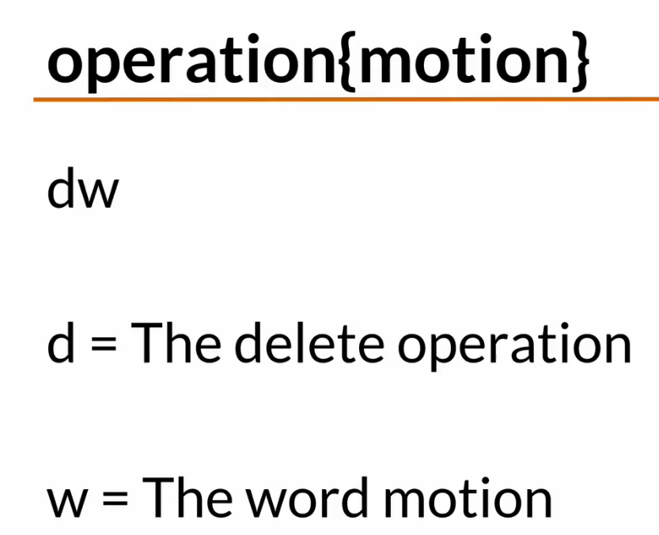
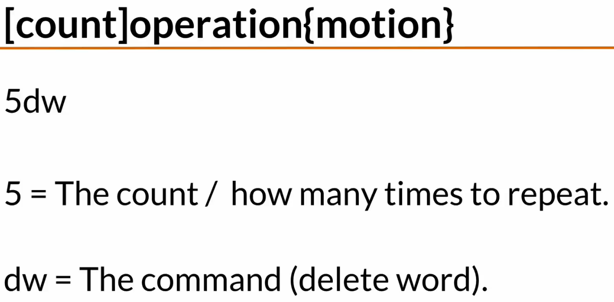
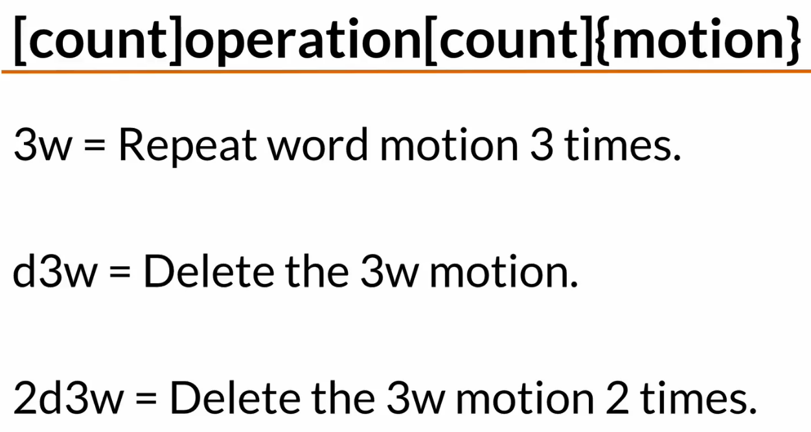

# This is my Vi learning journey


Just installed Vi keys to VS Code as well.

```script
ctrl + f

# Forward / backward by word
w W / b B

# go to 
gg number # go to specific line
gg # go to top
G # go to bottom 

```





I'm just adding here something to check partial push.