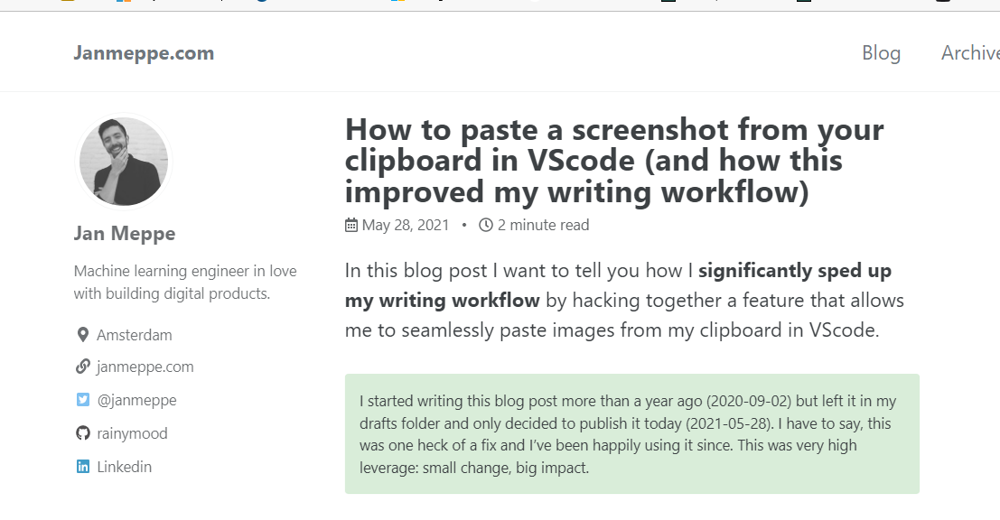

# Trust over IP
https://trustoverip.org/

# Github pages up and running!

testing here if i can use images

## looking gitops

https://www.youtube.com/watch?v=JtZfnrwOOAw

## Found a way to easily paste images to here!
Found this fantastic hint [Paste images to VS Code](https://www.janmeppe.com/blog/paste-image/)

