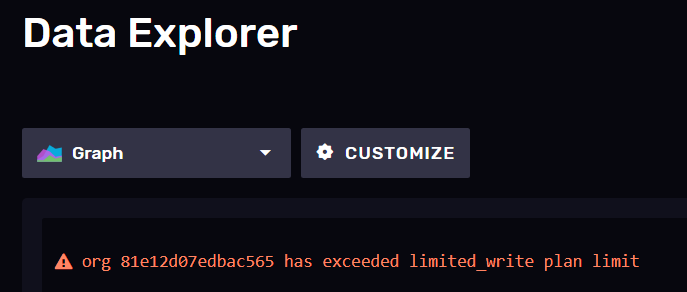
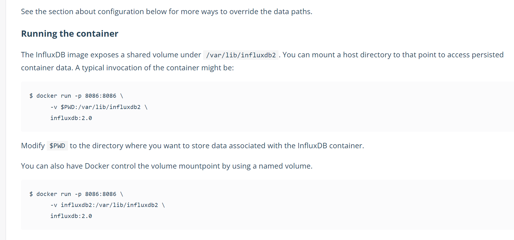
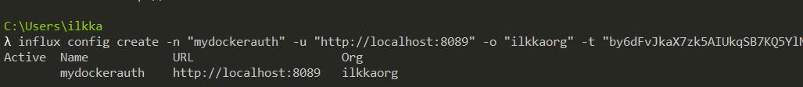
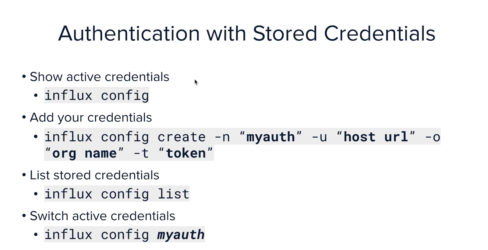

I tried the cloud option but quickly ran into limitations:

So I decided to deploy it to my local docker desktop:

installing influxdb cli locally

The influxdb University seems like a very nice resource!
