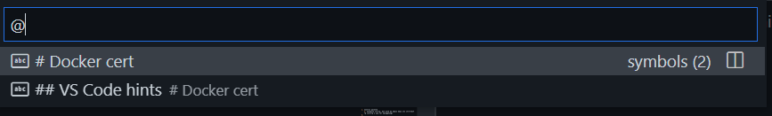
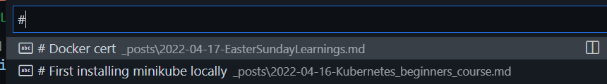
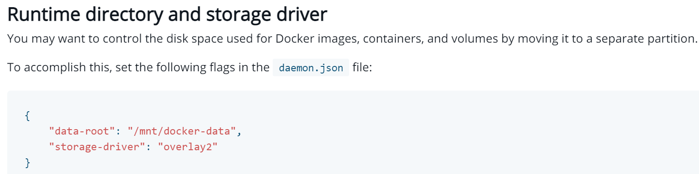
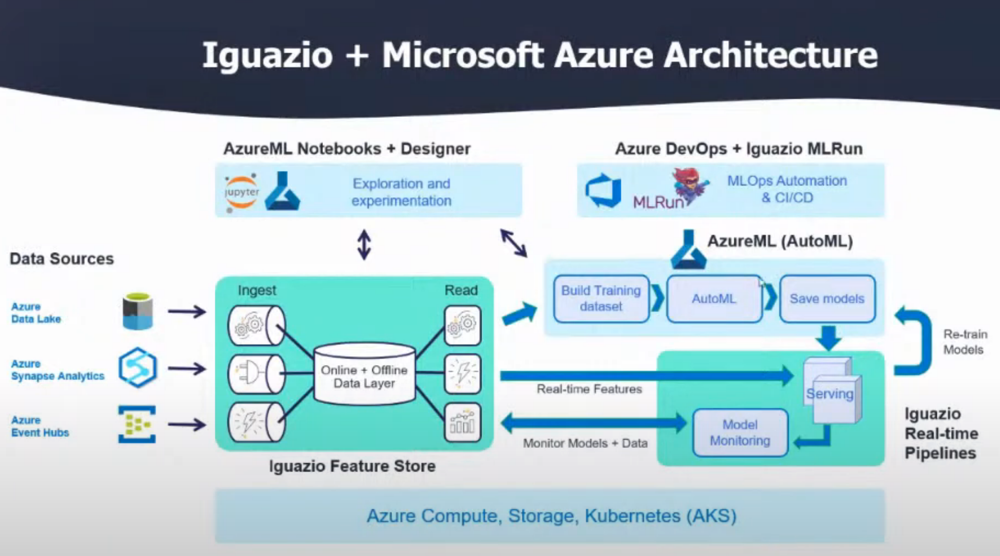

# Docker cert
* Spent most of the morning going through kodekloud docker cert course, fantastic stuff!
* Then checked a bit on Jira/Scrum to see how I might put my personal projects as 1 month scrum projects (might be braindead idea but will check)
* Now going through a VS code tut: Was thinking of whether to try the PyCharm toolings, but now that I use Docker and especially K8S etc so much, VS code seems to have a better integrations

## VS Code hints 
<https://www.youtube.com/watch?v=ifTF3ags0XI>

1. Control palette
   1. normally ctrl+p, but with my emacs keys its ctrl+shif+p (ctrl+p i use for navigating)
   2. @ symbol magic: 
   3. @ magic also with ctrl+shift+. for current file
   4. \# magic : 
2. Multiline editing with alt+click
## Other stuff
   * Randomly learned how to setupt cmder terminal <https://github.com/cmderdev/cmder/wiki/Seamless-VS-Code-Integration>
   * My Centos 8 had reserved 99% of disk to /home, but docker images were stored in /var, so to change that i need to do following 
## Mlrun sidetrack...

1. 
2. 
3. 

