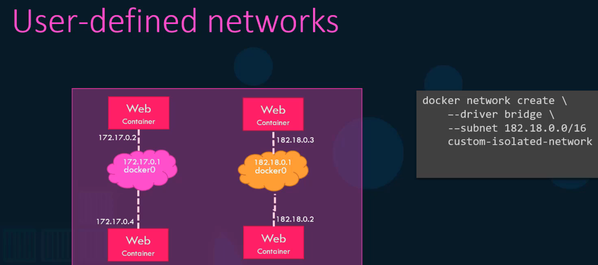

# Docker Networking (kodekloud)




# weird sidetrack: tmux etc
I decided I wanted to run tmux locally and started googling. First I found an interesting project called Babun <https://babun.github.io/> but unfortunately it seems to be discontinued.

After more searching I ended up here : <https://dev.to/mbcrump/windows-git-prompt-for-wsl-bash-and-powershell-7m9>

And now my WSL and PowerShell are very 'posh' ...

Which also included installing "powerline" written in go <https://github.com/justjanne/powerline-go>
while installing that I had to fix some obscure Go cert issues by runnign the following:

sudo apt update && sudo apt install ca-certificates libgnutls30 -y

so now my WSL looks like this:


not entirely sure if its optimal and why the hell did I go to this rabbit hole again ;)

# Random testings: 
## Code block

```python
def function(x):
    return x
```
What about shell
```shell
sudo ip netns add red
sudo ip netns add blue
sudo su
ip link add veth-red type veth peer name veth-blue
```


