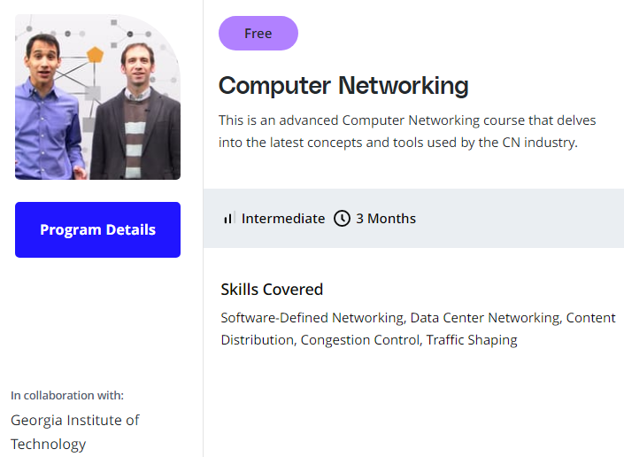

# Udacity course
Udacity has a nice looking networking course from Georgia Institute of Technology that goes really indepth. 

I went through couple of the introduction lecture series, but decided not to dig too deep into routing algorithms etc. as those are not currently relevant.

# Youtube
There is a nice "stack" of lectures on Linux networking, all seemingly based on one tutorial. These include the kodekloud one, and also this <https://www.youtube.com/watch?v=_WgUwUf1d34>

## Open switch
<https://www.youtube.com/watch?v=rYW7kQRyUvA>

### Testing from another laptop

# How to setup home VM clusters

I've been wondering should I use proxmox or vagrant or what, and then realized I could maybe use Terraform and learn it at the same time.

Found this interesting lecture... perhaps I'll also add Ansible to this soup <https://www.hashicorp.com/resources/ansible-terraform-better-together>

## Trying to link internally
[vi time!](../_pages/vi.md)

