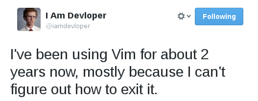

# Intro

I've been struggling with myself whether to spent time learning Vim which seems like a weird sidetrack, but on the otherhand I've noticed that when editing container config files etc, its often not possible to use emacs based editor, and similarly things like Jupyter have horrible support for it. So, if I do end up choosing to learn Vim, its better to do it as soon as possible, and as I've got no really urgent deadlines coming, I suppose I'll do it now. I'm also really curious to integrating it with all the tmux ideas.

## Resources

I'm currently using the fantastic CloudAcademy Vim Masterclass as well as the Coding Fu with VSCode as my learning material.

Rest of the Vi explorations to be made in the dedicated Vi page: 
[vi time!](../_pages/vi.md)