```bash
git ls-tree HEAD
git log --graph --all --oneline --decorate
```


## Small sidetrack: command prompt
I'm using WSL in Windows Terminal. There is a nice little prompt style implemented in go:
https://github.com/justjanne/powerline-go

With it I can configure the (git) prompt as so:


And there are a ton of other options:

```bash
Usage of powerline-go:
  -alternate-ssh-icon
         Show the older, original icon for SSH connections
  -colorize-hostname
         Colorize the hostname based on a hash of itself, or use the PLGO_HOSTNAMEFG and PLGO_HOSTNAMEBG env vars (both need to be set).
  -condensed
         Remove spacing between segments
  -cwd-max-depth int
         Maximum number of directories to show in path
         (default 5)
  -cwd-max-dir-size int
         Maximum number of letters displayed for each directory in the path
         (default -1)
  -cwd-mode string
         How to display the current directory
         (valid choices: fancy, semifancy, plain, dironly)
         (default "fancy")
  -duration string
         The elapsed clock-time of the previous command
  -duration-min string
         The minimal time a command has to take before the duration segment is shown (default "0")
  -east-asian-width
         Use East Asian Ambiguous Widths
  -error int
         Exit code of previously executed command
  -eval
         Output prompt in 'eval' format.
  -git-assume-unchanged-size int
         Disable checking for changed/edited files in git repositories where the index is larger than this size (in KB), improves performance (default 2048)
  -git-disable-stats string
         Comma-separated list to disable individual git statuses
         (valid choices: ahead, behind, staged, notStaged, untracked, conflicted, stashed)
  -git-mode string
         How to display git status
         (valid choices: fancy, compact, simple)
         (default "fancy")
  -hostname-only-if-ssh
         Show hostname only for SSH connections
  -ignore-repos string
         A list of git repos to ignore. Separate with ','.
         Repos are identified by their root directory.
  -ignore-warnings
         Ignores all warnings regarding unset or broken variables
  -jobs int
         Number of jobs currently running
  -max-width int
         Maximum width of the shell that the prompt may use, in percent. Setting this to 0 disables the shrinking subsystem.
  -mode string
         The characters used to make separators between segments.
         (valid choices: patched, compatible, flat)
         (default "patched")
  -modules string
         The list of modules to load, separated by ','
         (valid choices: aws, bzr, cwd, direnv, docker, docker-context, dotenv, duration, exit, fossil, gcp, git, gitlite, goenv, hg, host, jobs, kube, load, newline, nix-shell, node, perlbrew, perms, plenv, rbenv, root, rvm, shell-var, shenv, ssh, svn, termtitle, terraform-workspace, time, user, venv, vgo, vi-mode, wsl)
         Unrecognized modules will be invoked as 'powerline-go-MODULE' executable plugins and should output a (possibly empty) list of JSON objects that unmarshal to powerline-go's Segment structs.
         (default "venv,user,host,ssh,cwd,perms,git,hg,jobs,exit,root")
  -modules-right string
         The list of modules to load anchored to the right, for shells that support it, separated by ','
         (valid choices: aws, bzr, cwd, direnv, docker, docker-context, dotenv, duration, exit, fossil, gcp, git, gitlite, goenv, hg, host, jobs, kube, load, newline, nix-shell, node, perlbrew, perms, plenv, rbenv, root, rvm, shell-var, shenv, ssh, svn, termtitle, terraform-workspace, time, user, venv, vgo, wsl)
         Unrecognized modules will be invoked as 'powerline-go-MODULE' executable plugins and should output a (possibly empty) list of JSON objects that unmarshal to powerline-go's Segment structs.
  -newline
         Show the prompt on a new line
  -numeric-exit-codes
         Shows numeric exit codes for errors.
  -path-aliases string
         One or more aliases from a path to a short name. Separate with ','.
         An alias maps a path like foo/bar/baz to a short name like FBB.
         Specify these as key/value pairs like foo/bar/baz=FBB.
         Use '~' for your home dir. You may need to escape this character to avoid shell substitution.
  -priority string
         Segments sorted by priority, if not enough space exists, the least priorized segments are removed first. Separate with ','
         (valid choices: aws, bzr, cwd, direnv, docker, docker-context, dotenv, duration, exit, fossil, gcp, git, gitlite, goenv, hg, host, jobs, kube, load, newline, nix-shell, node, perlbrew, perms, plenv, rbenv, root, rvm, shell-var, shenv, ssh, svn, termtitle, terraform-workspace, time, user, venv, vgo, vi-mode, wsl)
         (default "root,cwd,user,host,ssh,perms,git-branch,git-status,hg,jobs,exit,cwd-path")
  -shell string
         Set this to your shell type
         (valid choices: autodetect, bare, bash, zsh)
         (default "autodetect")
  -shell-var string
         A shell variable to add to the segments.
  -shell-var-no-warn-empty
         Disables warning for empty shell variable.
  -shorten-eks-names
         Shortens names for EKS Kube clusters.
  -shorten-gke-names
         Shortens names for GKE Kube clusters.
  -static-prompt-indicator
         Always show the prompt indicator with the default color, never with the error color
  -theme string
         Set this to the theme you want to use
         (valid choices: default, low-contrast, gruvbox, solarized-dark16, solarized-light16)
         (default "default")
  -trim-ad-domain
         Trim the Domainname from the AD username.
  -truncate-segment-width int
         Maximum width of a segment, segments longer than this will be shortened if space is limited. Setting this to 0 disables it.
         (default 16)
  -venv-name-size-limit int
         Show indicator instead of virtualenv name if name is longer than this limit (defaults to 0, which is unlimited)
  -vi-mode string
         The current vi-mode (eg. KEYMAP for zsh) for vi-module module
```

# Git Reset types

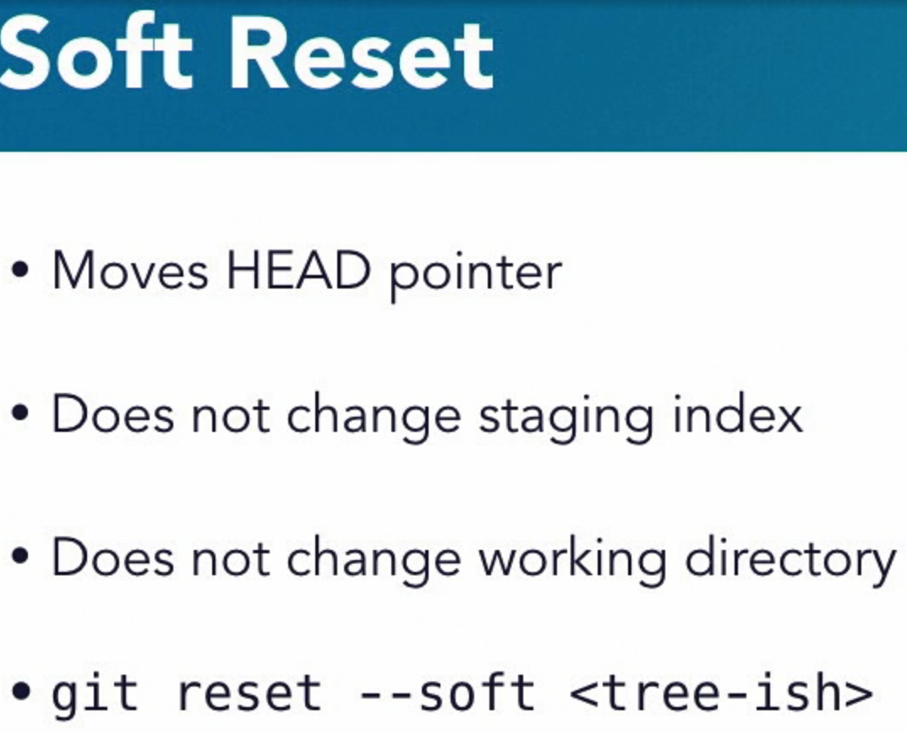

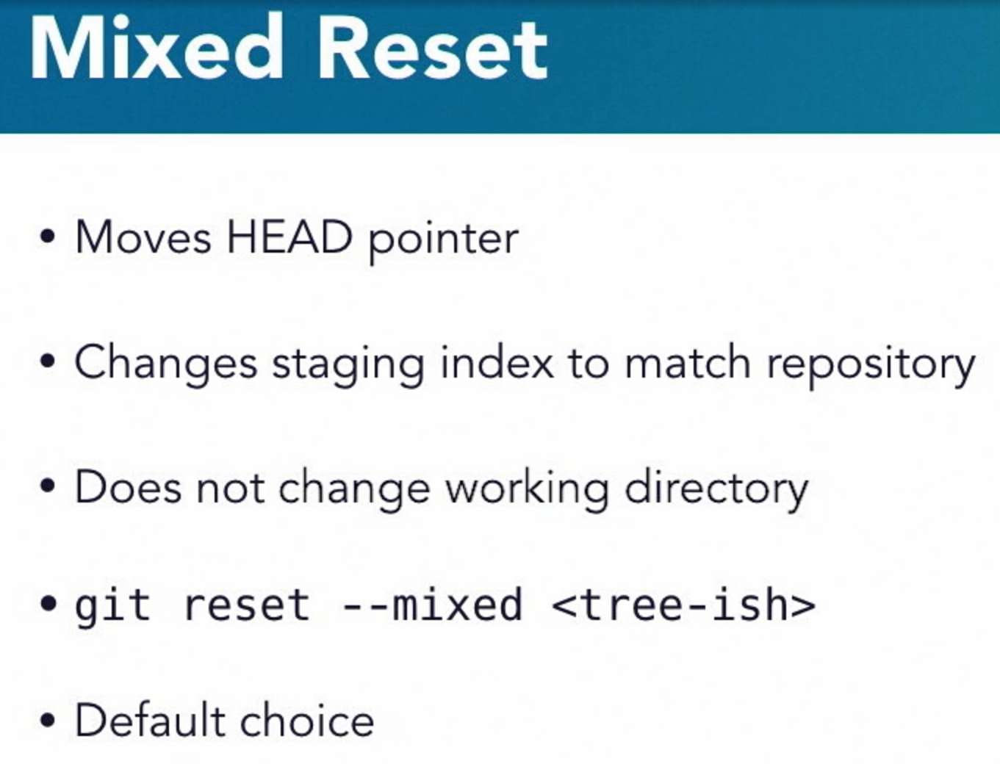
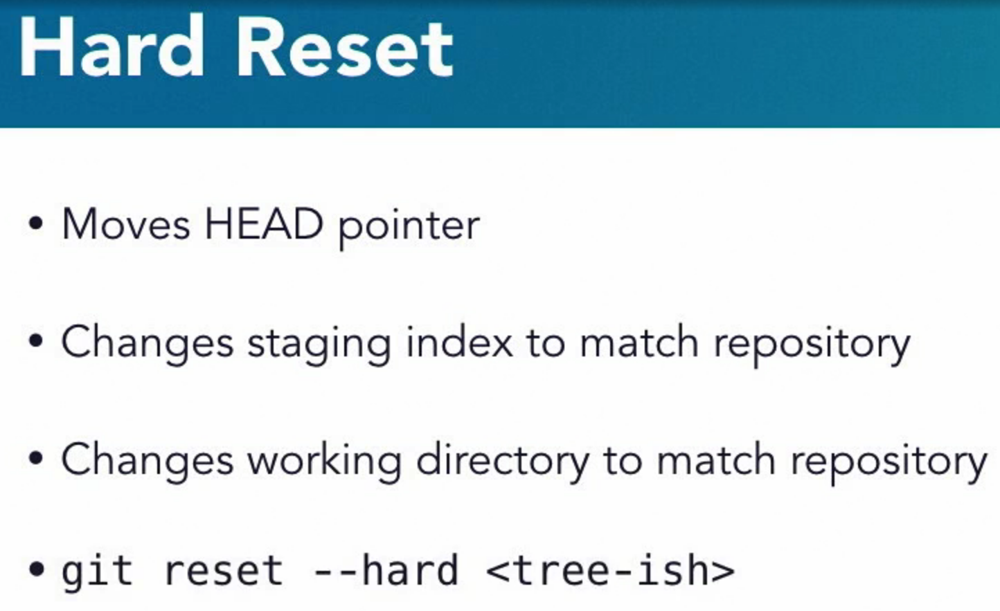

## Git Stash

```bash
git stash list
git stash show -p stash@{0}

# another example

git stash save "changed something"
#then either
git stash pop
# or
git stash apply # and you can put the stash name/number here stash@{4} etc.

# you can clear stash with
git stash pop
git stash clear
git stash drop
```

# Git remotes

origin/master is actually a branch on local git
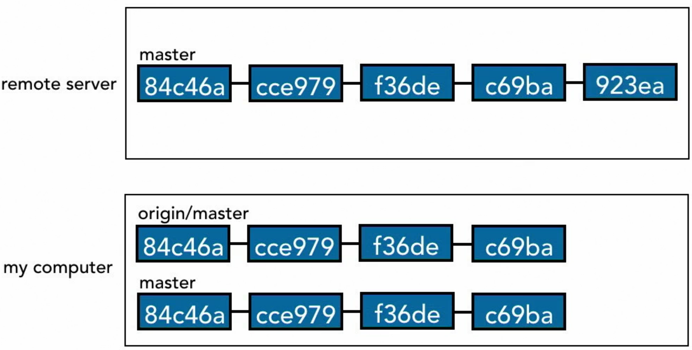

Fetch modified origin/master locally, but not the local master

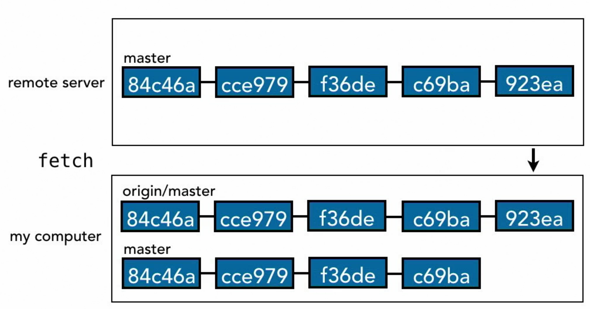

in reality there are no full branches, just pointers:
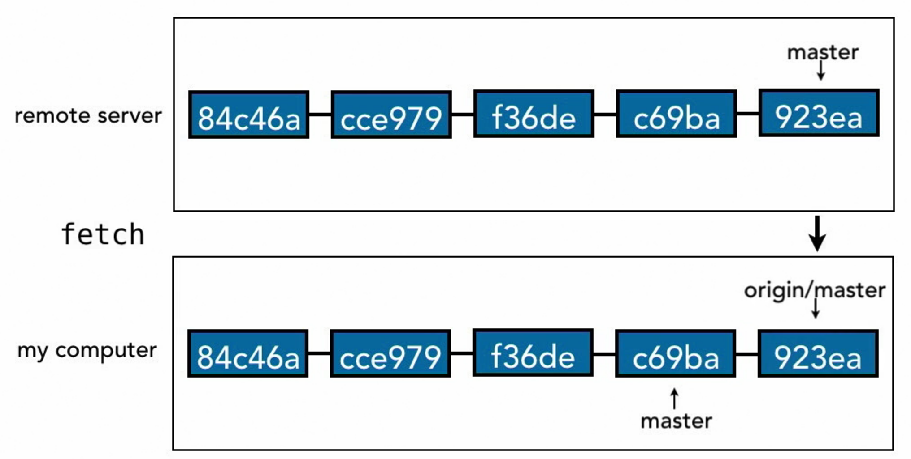

```bash
# Check difference between local master and (local tracking) origin/master

git diff --color-words origin/master..master
```

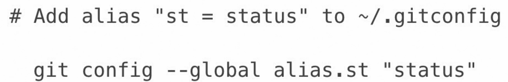

### complete sidenote on Windows Terminal

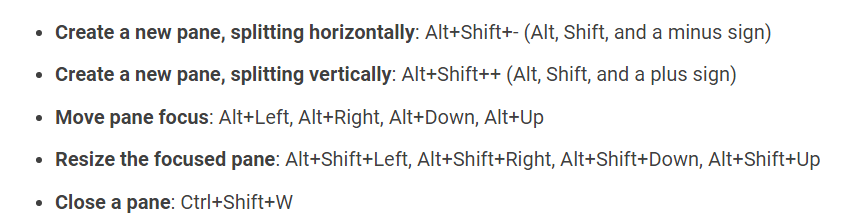


# If you lose your head:

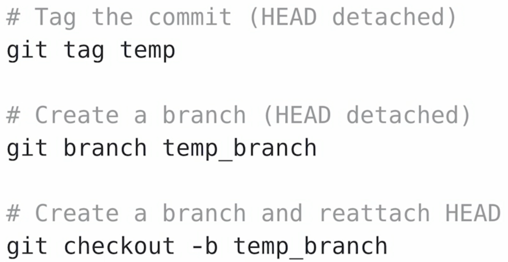

# Deeper dive into Git

# notice the dirname b7 and the object name are the same as the hash of Hello, Git
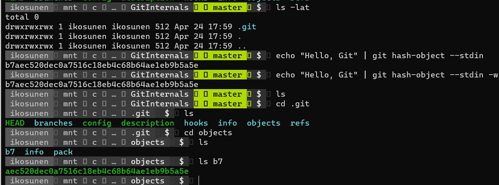

### Back in linkedin course we are at rebasing:
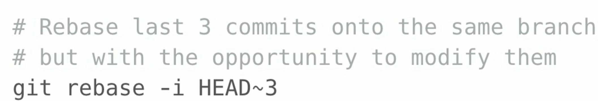

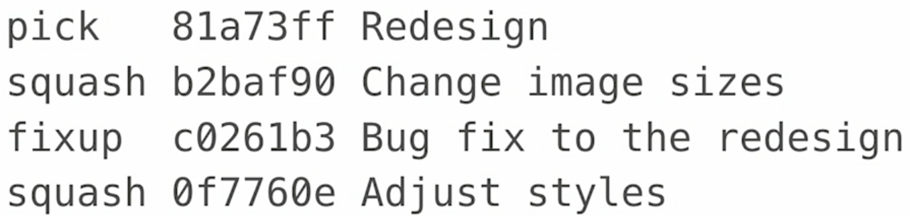

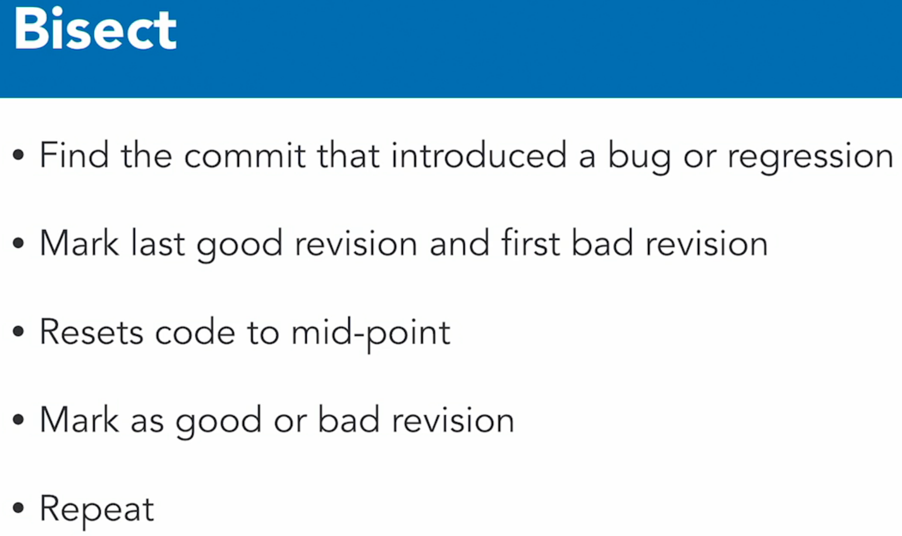