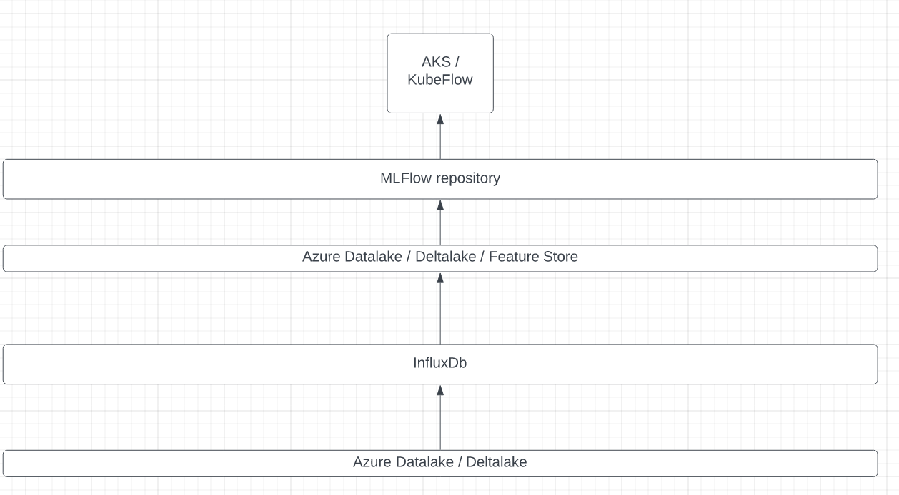
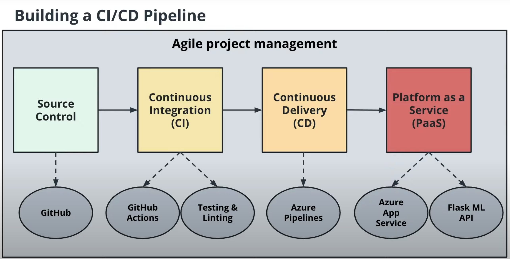
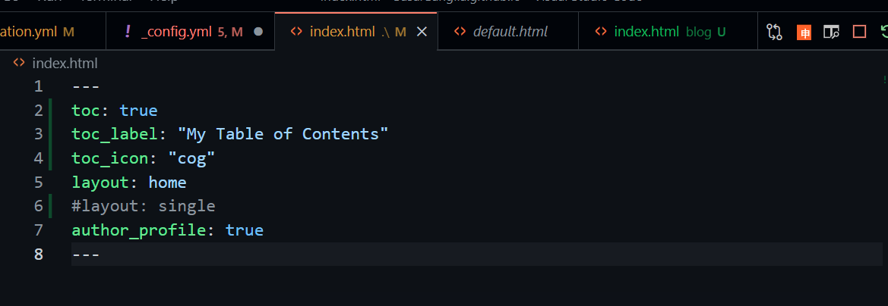

# MLOps for Fun and Profit

I believe best way to learn is by doing (ok, perhaps its the *second* best way: teaching might be the best), so I decided to try a megalomanic project to combine all the hype technologies together in order to compete in one of the current Kaggle competitions. Using all these different pieces is clearly an overkill, but I do it simply for pedagogical purposes.

Udacity Azure DevOps nanodegree has a nice architecture from which I'll take what I find useful:

### Side note again: playing around Jekyll, still trying to learn how this whole thing works...

fantastic youtube series on Jekyll here: https://www.youtube.com/watch?v=CLCaJJ1zUHU