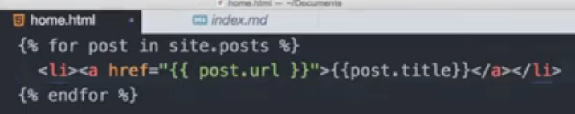

## Finally was able to make a working sidebar after some trial and error.

Had to add following to the navigation.yml file:
```markdown
pages:
  - title: "Kubernetes Study Journal"
    url: /k8s/
```
and the following to the main _config.yml:

```markdown

# Defaults
defaults:
  # _posts
  - scope:
      path: ""
      #type: posts
    values:
      layout: single
      author_profile: true
      read_time: true
      comments: # true
      share: true
      related: true

      # Here is the new part:
      sidebar:
        nav: pages 
```
## Study the variables
https://jekyllrb.com/docs/variables/

## Check how to use this approach for pages


# Vim time!

Did my daily Wim tutor practice and then found a nice rabbit hole in Youtube again. First ran into this interesting live coding video https://www.youtube.com/watch?v=2WPC8rZQvQU which pointed me towards a tool called fzf https://www.youtube.com/watch?v=qgG5Jhi_Els