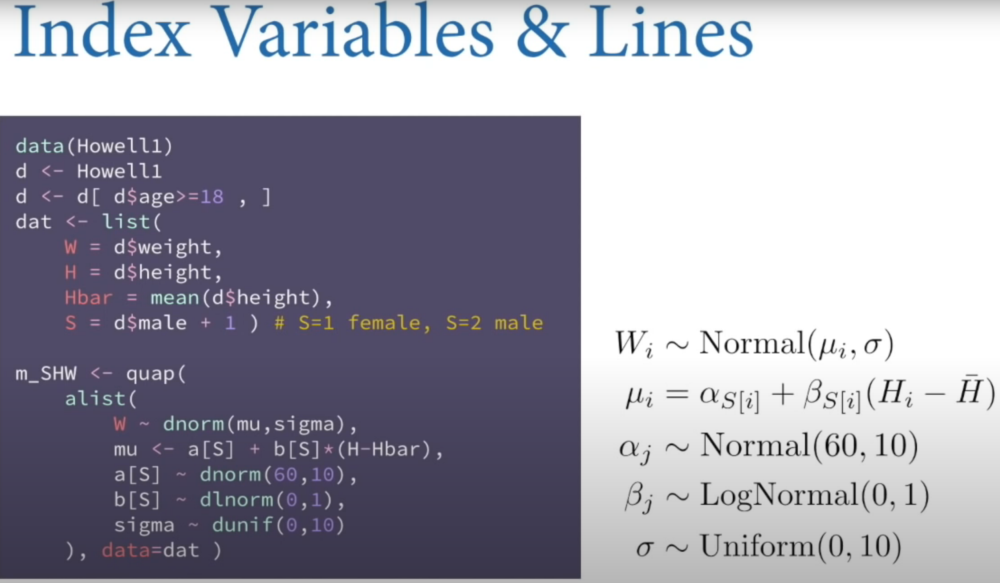
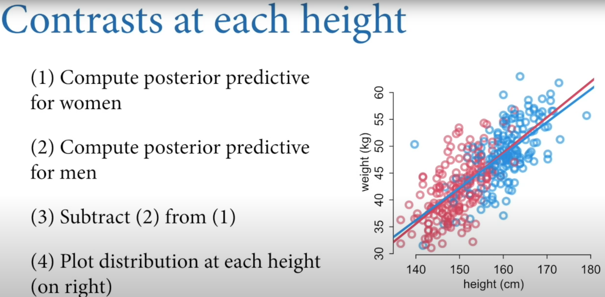
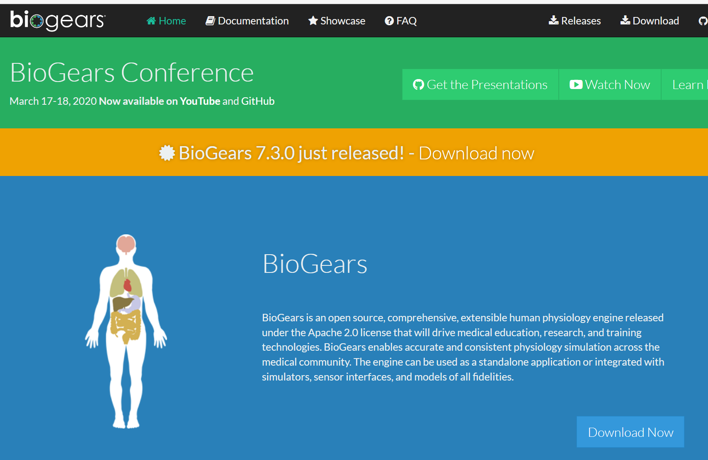

# Continuing to follow the rethinking course
Due to being quite busy with work I've had less time to update my blog, but I'll try to preserve at least some time each day.

He really has fantastic ability to explain the causal inference process: 

Again, I've got no copyright to this stuff so please go check Richard McElreath's fantastic book and accompanying biyearly youtube lecture series! https://xcelab.net/rm/statistical-rethinking/

I've bought my hardback copy so I feel I've donated something for the rethinking cause!

# Totally random side turn: BioGears

