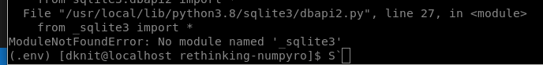
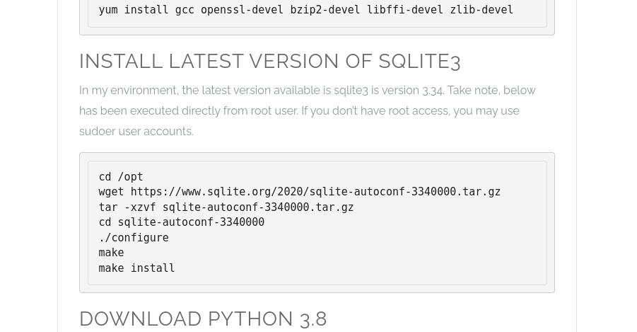

## The image pasting does not seem to work for whatever reason :(
The problem of image pasting was fixed after installing xclip
```bash
sudo yum -y install xclip
```
Now I'm stuck because pip wants _sqlite for whatever reason



