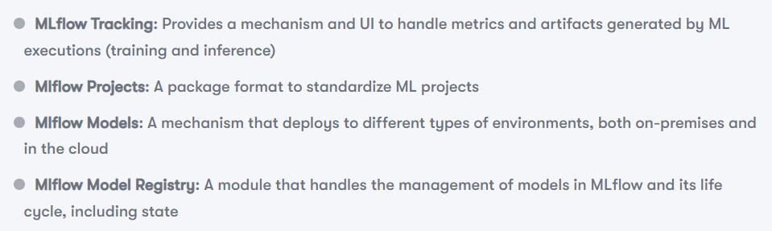

# Using Gitpod with dockerfiles

I started going through a MLFLow ML Engineering book that has Dockerfiles for each chapter. If I open the repository in Gitpod, I can run these docker containers inside the gitpod container, and connect to them via jupyter or VS Code.



## MLFlow project

There are three different environments supported by MLflow projects: conda, docker and local.

Docker env for mlflow project: 

name: syspred
docker_env:
  image: stockpred-docker
entry_points:
  main:
    command: "python mljob.py"

## MLflow Tracking

The MLflow tracking component is responsible for observability. The main features of this module are the logging of metrics, artifacts, and parameters of an MLflow execution. It provides vizualisations and artifact management features.

## MLflow Models

handles different model flavors that are supported in MLflow and intermediates the deployment into different execution environments.

Internally, MLflow sklearn models are persisted with the conda files with their dependencies at the moment of being run and a pickled model as loggedby the source code.

MLflow, by default supports serving models in two flavors, namely, as a python_function or in sklearn format. 

Its easy to serve the models
```python
mlflow models serve -m ./mlruns/0/b9ee36e80a934cef9cac3a0513db515c/artifacts/model_random_forest/
```
and to test it:
```shell
curl http://127.0.0.1:5000/invocations -H 'Content-Type: application/json' -d '{"data":[[1,1,1,1,0,1,1,1,0,1,1,1,0,0]]}' [1]%
```

## MLflow Model Registry

Upon registering the model, you can annotate the registered model with the relevant metadata and manage its life cycle. One example is to have models in a staging pre-production environment and manage the life cycle by sending the model to production.